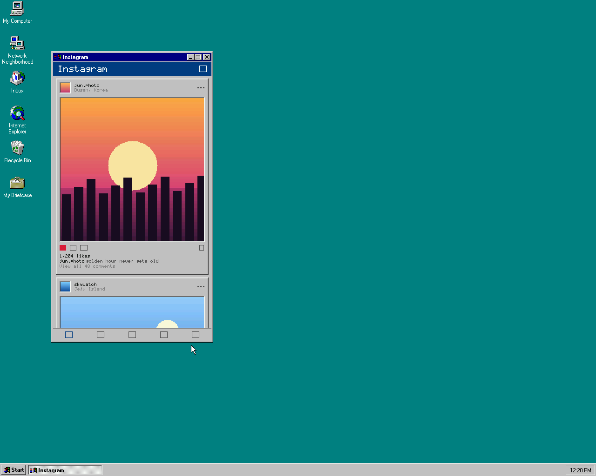

# instagram-on-nt40

**Windows NT 4.0용 네이티브 인스타그램 클라이언트** — C로 밑바닥부터. 브라우저도,
GUI 프레임워크도, OS 네이티브 TLS도 안 씁니다. macOS(Apple Silicon)에서 크로스컴파일해
QEMU x86 에뮬레이션 위에서 돌립니다.



- **렌더링**: 손수 짠 알파 블렌딩 + 오너드로우 컨트롤을 얹은 32bpp DIB-섹션 컴포지터.
  Win32 GDI 바로 위에서 동작.
- **이미지**: 밑바닥부터 구현한 **QOI** 디코더 (JPEG 라이브러리 불필요, freestanding 친화적).
- **네트워킹**(예정): Winsock2 + 비동기 + 직접 만든 HTTP/WebSocket 클라이언트.
- **암호화**(예정): **mbedTLS** 번들로 TLS 1.2 + SNI (NT4의 SChannel은 최신 암호/TLS 1.2
  불가), 엔트로피는 NT4 `CryptGenRandom`에서.

전체 아키텍처는 [native.md](native.md), QEMU/툴체인 환경은 [setup.md](setup.md) 참고.

## 디렉토리 구조

| 디렉토리 | 역할 | 테스트 |
|-----|------|--------|
| `core/` | OS 독립 순수 C: `raster`(DIB 픽셀·알파·다운스케일), `font`(5x7 비트맵 폰트); 이후 `http` `ws` `json` `model` | Mac clang + ASan/UBSan |
| `img/`  | `qoi` — 밑바닥부터 만든 QOI 이미지 코덱 (디코드+인코드) | ASan 라운드트립 |
| `pal/`  | 얇은 Win32 래퍼: 창, DIB-섹션 더블버퍼, COM1 로그, freestanding CRT shim, 파일 로더 | NT4 통합 |
| `ui/`   | NT4 GDI: 회색 베벨 피드 컴포지터 + 커스텀 컨트롤 | NT4 통합 |
| `tools/` | VM 실행/캡처/전송 스크립트, 호스트 렌더 프리뷰, `mkqoi` 신 생성기 | — |

전략: **순수 코어를 크게** 유지하고 NT4 전용 코드는 얇게. 대부분의 로직을 Mac에서 풀스피드로
검증하고, VM은 최종 통합용으로만 씁니다.

## 빌드

`brew install qemu mingw-w64 cmake imagemagick wireshark` 와 Xcode CLT 필요.

```bash
make test      # core/ + 테스트를 clang + ASan/UBSan로 빌드·실행
make nt4       # NT4 앱을 크로스컴파일 -> dist/app.exe (i686-w64-mingw32)
make preview   # 피드를 호스트에서 오프스크린 렌더 -> build/feed.png
```

`make preview`는 NT4 앱이 만드는 것과 *완전히 동일한* 프레임버퍼를 렌더합니다 (피드가 순수
`core/raster`라서). VM 부팅 없이 룩을 반복 개선할 수 있어요.

## NT4에서 실행 (QEMU)

작동이 확인된 QEMU 설정 (자세한 내용은 [docs/vm-notes.md](docs/vm-notes.md)):

```bash
make nt4
# app.exe + assets/photos/*.qoi 를 ISO로 묶어 CD로 게스트에 전달
hdiutil makehybrid -iso -joliet -o vm/app.iso vm/xfer
./tools/run-vm.sh                    # -cpu 486 -device cirrus-vga, COM1->vm/debug.log, monitor :5555
# NT4에서:  Start -> Run -> D:\app.exe
./tools/screendump.sh vm/nt4.png     # 실제 게스트 렌더 캡처
tail -f vm/debug.log                 # 앱의 COM1 디버그 로그
```

> NT4 설치는 수동 1회 작업입니다 (NT4 ISO 필요) — [setup.md](setup.md) §2 참고.

## NT4 타게팅 규칙 (강제)

`-D_WIN32_WINNT=0x0400 -DWINVER=0x0400`로 API 표면을 제한하고, 링커 플래그로 PE의
서브시스템/OS 버전을 4.0으로 찍습니다. `AlphaBlend`/`UpdateLayeredWindow`/비주얼 스타일
안 씀 — 알파는 `core/raster`에서 직접. 빌드 검증:

```bash
make nt4 && python3 - <<'PY'
import struct; d=open('dist/app.exe','rb').read(); o=struct.unpack_from('<I',d,0x3c)[0]+24
print("subsystem", struct.unpack_from('<H',d,o+68)[0], "(2=GUI)",
      "os", struct.unpack_from('<HH',d,o+40), "subsysver", struct.unpack_from('<HH',d,o+48))
PY
# exe가 kernel32/user32/gdi32 만 임포트하고 CMOV가 0인지도 확인
```

## 진행 상황

- [x] **마일스톤 0** — 리포, 2타겟 빌드, `core/raster` + ASan 테스트, 호스트 프리뷰
- [x] **마일스톤 1 — 실물 NT4에서 실행**: DIB 컴포지터 + 더블버퍼, freestanding(무 CRT)
      `app.exe`가 QEMU에서 로드되어 창을 띄움
- [x] **마일스톤 2 — 회색 베벨 피드**를 NT4에서 트루컬러로 렌더 (Cirrus @ 1280x1024)
      — 부드러운 그라디언트, 액션바, 네비바
- [x] **마일스톤 2.1 — 진짜 텍스트**: `core/font`의 5x7 비트맵 폰트 (Instagram 워드마크,
      유저네임, 위치, 좋아요, 캡션, 댓글) — NT4에서 검증
- [x] **마일스톤 3 — 이미지 디코드**: `img/qoi`에 밑바닥부터 만든 **QOI** 코덱 (JPEG
      라이브러리 불필요, freestanding 친화적). CD에서 `.qoi` 사진을 로드(`pal_read_file`)해
      디코드 + area-다운스케일 후 피드에 표시. 샘플 신은 `tools/mkqoi`로 제작. NT4에서 검증
- [x] **마일스톤 3.1 — 스크롤 피드**: WS_VSCROLL 실제 OS 스크롤바 + 키보드
      (화살표/PageUp·Down/Home·End) + 마우스휠. 고정 앱바·네비 사이에서 포스트 스크롤.
      NT4에서 검증
- [x] **마일스톤 3.2 — 진짜 JPEG 디코드**: `img/jpeg`가 벤더링한 `stb_image.h`를
      JPEG 전용·freestanding으로 설정(`STBI_ONLY_JPEG`+`STBI_NO_LINEAR`로
      math.h 의존성 완전 제거, `malloc`/`free`는 이름이 같아 오버라이드 불필요,
      `STBI_NO_THREAD_LOCALS`로 `__emutls_get_address` 링크 에러 해결). QOI와
      동일한 API라 `core/model_private`가 뽑아낸 사진·영상커버 URL을 그대로 디코드
      가능. 141 checks, NT4에서도 CMOV 0개로 클린 빌드
- [x] **네트워킹 순수 코어**: `core/json`(재귀하강 JSON DOM, \uXXXX→UTF-8), `core/http`
      (요청 빌더 + Content-Length/chunked 응답 파서), `core/model`(Graph API 미디어
      JSON → Feed/Post) — 전부 Mac에서 ASan 테스트 (112 checks), VM 불필요
- [x] **게스트 네트워킹**: AMD PCnet + TCP/IP + DHCP 전부 NT4에서 확인됨
      (`ipconfig`: 10.0.2.15/24 gw 10.0.2.2). `ping 10.0.2.2`, `ping 8.8.8.8` 둘 다 성공
      — QEMU NAT로 **실제 인터넷 도달 가능** 확인 (`docs/screenshots/nt4-networking-ping-internet.png`)
- [x] **마일스톤 4 — 소켓**: `pal/net`(Winsock 1.1/`wsock32`, NT4 네이티브 — `ws2_32`
      불필요). `dist/nettest.exe`가 NT4에서 소켓 connect → HTTP 요청 → 응답 파싱 →
      JSON → Feed 매핑까지 전 과정 실행, 호스트의 `tools/mock_graph_server.py`
      (평문 HTTP, `10.0.2.2:8080`)와 왕복 성공. exe는 kernel32/user32/wsock32만
      임포트(gdi32 없음 — `pal_common_win32.c`로 로그·파일함수 분리)
- [x] **마일스톤 5 — mbedTLS, 실제 TLS 1.2 핸드셰이크**: v2.28.10 벤더링, 전체 라이브러리
      (96개 파일)가 freestanding i486 NT4 타겟으로 클린 컴파일 (`build/libmbedtls_nt4.a`,
      357KB). `net/tlstest_main.c`가 `pal` 소켓을 mbedTLS BIO에 연결해 **실제
      X.509 체인 검증까지 포함한(스킵 아님)** TLS 1.2 핸드셰이크를 NT4 실물에서 성공 —
      `TLS-ECDHE-RSA-WITH-AES-256-GCM-SHA384`로 셀프사인 HTTPS mock
      (`tools/mock_graph_server_tls.py`)에 접속, HTTP→JSON→모델 전체 파이프라인이
      TLS 위에서 정상 동작 (포스트 2개 정확히 파싱). `dist/tlstest.exe`(222KB, mbedTLS
      풀스택 포함)는 advapi32/kernel32/user32/wsock32만 임포트, **CMOV 0개**.
      🌟 **스트레치 골 달성**: 진짜 `graph.instagram.com:443`과 실제 TLS 1.2 핸드셰이크
      성공 (`DigiCert Global Root G2` 임베드, `openssl s_client`로 확인 + macOS 신뢰
      저장소 지문 대조). 토큰 없이도 Meta의 **진짜 Graph API가 정상 파싱된 에러 JSON**
      (`Invalid OAuth 2.0 Access Token`, code 190)으로 응답 — DNS·소켓·TLS·HTTP
      전 스택이 실제 프로덕션 엔드포인트와 완전히 왕복함을 증명
- [x] **마일스톤 6 — 진짜 홈피드**: 브리지 서버 없이, NT4가 **직접** Instagram의
      비공식 private 모바일 API(`i.instagram.com`)와 통신 — 실제 로그인 세션(쿠키·
      디바이스 지문)을 한 번 export해 NT4에 baked, 매 요청 필요한 값(타임스탬프·UUID·
      랜덤 텔레메트리)만 그때그때 생성. `core/model_private`(private API 전용 JSON
      스키마 파서) + `net/ig_private`(헤더/바디 빌더) + `net/ig_feed_main` 완성.
      실제 홈피드(사진·캐러셀·영상·광고·한글 캡션+이모지) 8개 포스트 정확히 파싱 성공
      (661KB 무압축 응답). exe는 advapi32/kernel32/user32/wsock32만, **CMOV 0개**
- [x] **마일스톤 7 — GUI에 실 데이터 연결**: `ui/main.c`가 부팅 시 `net/ig_client`로
      실제 홈피드를 가져오고, 포스트마다 `image_url`을 `net/https_get`(제네릭 HTTPS
      GET, `net/ig_feed_main.c`의 TLS 보일러플레이트를 재사용 가능한 함수로 리팩터)로
      다운로드해 `img/jpeg`로 디코드 — 영상은 커버 프레임만(모션 디코드 없음, 486
      스코프 그대로). `ui/feed.c`는 `draw_post`를 공유하는 `PostView`로 리팩터해 목업
      피드(`ui_feed_render`/`FeedImages`, `make preview`가 계속 씀)와 실 피드
      (`ui_feed_render_real`/`FeedData`, 실 유저네임·캡션·좋아요수 + 디코드된 사진,
      사진 없는 포스트는 유저네임 해시 기반 그라디언트로 대체)가 레이아웃 코드를
      중복 없이 공유. 실 피드 가져오기 실패 시(세션 없음/네트워크 다운/IG 에러) 목업
      피드로 자동 폴백 — 빈 화면 없음. 147 host checks(신규 `test_feed_real`), NT4
      크로스컴파일 클린(280KB, mbedTLS 정적 링크 포함, 임포트 여전히 advapi32/gdi32/
      comctl32/user32/kernel32/wsock32뿐, **CMOV 0개**). **실물 NT4에서 검증**: COM1
      로그로 실제 `i.instagram.com` + `*.cdninstagram.com` TLS 접속, 실 포스트별
      사진 성공/실패(광고 포스트는 image_url 자체가 없어 그라디언트로 정상 대체)
      확인, 실 유저네임이 렌더된 창 스크린샷 확보

### 🎯 최종 목표 (북극성) — 업데이트됨
설치만 하면 **로그인까지 전부 동작**하는 모놀리딕 단일 `app.exe`. 처음엔 ToS 안전한
공식 Graph API만 고려했지만, official API는 구조적으로 **"내 게시물"만** 노출하고
홈피드·타인 게시물·좋아요/댓글은 아예 엔드포인트가 없다는 걸 확인 → 진짜 "피드" 경험을
위해 **비공식 private API(브리지 없이 직접)** 로 방향 전환 (계정 위험은 사용자가 감수).
공식 Graph API 경로(마일스톤 5의 `graphtest`)도 여전히 코드로 남아있어 필요시 병행 가능.
남은 일: 에셋 임베드로 CD 의존 제거, 로그인/토큰 입력 UI → 완전한 모놀리딕 최종 빌드.

### 해결한 NT4 함정들 (자세히는 `docs/vm-notes.md`)

- **설치 중 BSOD 0x1E** (탈착식 미디어 클래스 드라이버) → `-cpu 486 -nodefaults`
- **"unable to load DLL"** → Homebrew mingw가 UCRT(NT4에 없음)에 링크함. **freestanding**
  으로 빌드 (`-nostdlib` + `pal/nt4_crt.c`가 자체 엔트리/힙/mem*, 로그는 `wvsprintfA`) →
  exe가 kernel32/user32/gdi32만 임포트. CMOV도 전부 제거됨
- **그라디언트 밴딩** → 기본이 640×480×16색. Cirrus 드라이버 설치해 트루컬러로

## 라이선스 / 주의

밑바닥부터 작성한 코드입니다. NT4 설치 미디어(ISO)와 CD 키는 저작권 대상이라 이 리포에
포함되지 않습니다 (`.gitignore`로 제외).
